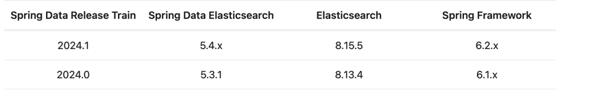

# 开发环境搭建

## 所需组件

* JDK(Azul zulu openJDK)：[21.0.4](https://www.azul.com/downloads/?package=jdk#zulu) - Java 开发工具包
* Maven：[3.9.9](http://maven.apache.org/download.cgi) - Java 依赖包管理工具
* Redis：[7.4.0](http://download.redis.io/releases/) - 内存型数据库
* MySQL：[8.4.2](https://dev.mysql.com/downloads/mysql/) - 关系型数据库
* Elasticsearch：[8.15.2](https://www.elastic.co/downloads/elasticsearch) - 全文检索引擎

### 以下待定
* ImageMagick：[6.9.2-10](http://www.imagemagick.org/script/download.php) - 图像处理工具
* FFmpeg：[3.4.2](http://ffmpeg.org/download.html) - 音频/视频处理工具
* MooseFS：[3.0.97](https://moosefs.com/download/) - 分布式文件系统

# JDK升级常见问题
* HogeRepository.save() 找不到
  * PagingAndSortingRepository不再继承CrudRepository。所以需要找到`HogeRepository`,将`PagingAndSortingRepository`改为`PagingAndSortingWithCrudRepository`,并引包 `com.wison.repository.PagingAndSortingWithCrudRepository`。
* 找不到`EnableEurekaClient`。
  * 被`EnableDiscoveryClient`替代了，找到报错行，删除`@EnableEurekaClient`注解和import即可（`EnableDiscoveryClient`注解应该已经自动加上了)。
* 对于元素 'name', 批注 @io.swagger.v3.oas.annotation.Tag 缺少默认值
  * 找到报错代码，将`description`改成`name`。
* 找不到符号 [ERROR]   符号:   类 SQLQuery
  * 将`org.hibernate.SQLQuery.class`修改为`org.hibernate.query.NativeQuery.class`
* 运行时错误：`No spring.config.import property has been defined`
  * 添加`spring-cloud-starter-bootstrap`依赖。
* 运行时错误：`The bean 'wison-auth.FeignClientSpecification' could not be registered. A bean with that name has already been defined and overriding is disabled.`
  * 将`@FeignClient("wison-auth")`或`@FeignClient(name = "wison-auth")`改为`@FeignClient(name = "wison-auth", contextId = "user")`
*  找不到符号
   [ERROR]   符号:   方法 notes()
   [ERROR]   位置: @interface io.swagger.v3.oas.annotations.media.Schema
* 找到报错地方，将`description`改为`title`, 并将`notes`改为`description`。
* 找不到符号
  [ERROR]   符号:   类 text
    * 删除`@Type(text.class)`，在@Schema注解中添加`format = "text"`
* 找不到符号
  [ERROR]   符号:   方法 getValue()
  [ERROR]   位置: 类型为net.sf.mpxj.TaskType的变量 type
    * `type.getValue()`改为`askTypeHelper.getValue(type)`
    * `getCurrentValue()`改为`get()`
* 启动时报`Cannot invoke "org.springframework.web.servlet.mvc.condition.PatternsRequestCondition.getPatterns()" because "this.condition" is null`
  * `@EnableSwagger2`注解先给注释了。以后调查。
* 报错 连接MySQL数据库的时候，报错内容如下：“Public Key Retrieval is not allowed”。
  * `mysql 8.0 默认使用 caching_sha2_password 身份验证机制 （即从原来mysql_native_password 更改为 caching_sha2_password。）

    从 5.7 升级 8.0 版本的不会改变现有用户的身份验证方法，但新用户会默认使用新的 caching_sha2_password 。 客户端不支持新的加密方式。 修改用户的密码和加密方式。

    方案一：
    在命令行模式下进入mysql，输入以下命令:

    ALTER USER 'root'@'localhost' IDENTIFIED WITH mysql_native_password BY 'root';
    或者

    ALTER USER 'root'@'%' IDENTIFIED WITH mysql_native_password BY 'root';
    然后就可以正常连接了。

    方案二：
    在配置数据源的时候直接将属性allowPublicKeyRetrieval设置为true即可`

# ES 5.5 -> ES 8.15.2 数据升级
> 操作前说明
> * 先把 当前运行的 /var/data/elasticsearch/data/nodes数据压缩打包到本地
> * 本地安装 ES8.15.2,并修改配置文件 elasticsearch.yml (config目录中)，

     node.name: node-1
     path.repo: /var/www/elasticsearch-8.15.2/snapshot
     path.logs: /var/www/elasticsearch-8.15.2/logs
     network.host: 0.0.0.0
     http.port: 9220
> * 启东 ES8，之后系统会自动配置，重置 ES的用户 elastic 的密码，./elasticsearch-reset-password --username elastic -i，
> * 重置为 1qazxsw2
> * 之后再修改 elasticsearch.yml，加密部分

    # 启用基础安全功能（必须）
    xpack.security.enabled: true
    # 关闭自动注册引导（避免 HTTPS 强制检查）
    xpack.security.enrollment.enabled: false
    # 关闭 HTTP 层的 SSL 加密（关键步骤）
    xpack.security.http.ssl:
    enabled: false  # 禁用 HTTPS
    # 注释或删除 keystore 配置
    # keystore.path: certs/http.p12
    # 保持传输层（节点间通信）的 SSL 加密（必须启用）
    xpack.security.transport.ssl:
    enabled: true
    verification_mode: certificate
    keystore.path: certs/transport.p12
    truststore.path: certs/transport.p12

    # 其他必要配置
    cluster.initial_master_nodes: ["node-1"]
    # network.host: 0.0.0.0  # 允许远程访问（按需调整）

# 代码发布说明

> 操作前说明
> * 详细的服务器环境部署说明请参考当前路径下 `./docs/specs/deployment-azure.xlsx` 中的相关内容
> * 请先查看本文提到的相关脚本的内容

0. 执行以下命令编译源代码

    ```bash
    $ mvn clean install
    ```

0. 执行以下脚本将编译生成的报表模板和 JAR 文件打包

    ```bash
    $ ./release.sh
    ```

    > 打包文件将保存到 `./target/` 下。

0. 执行以下脚本将上述文件上传到生产环境服务器的临时路径下

    ```bash
    $ ./publish.sh
    ```

    > 该脚本在上传完成后将执行以下操作
    > * 将报表模版解压到服务器的 `/mnt/mfs/resources/templates/reports/` 下
    > * 将 JAR 文件移动到服务器的 `/mnt/mfs/imos-jars/` 下

0. 确保生产环境数据库中的表、视图、存储过程等已更新

0. 通过浏览器访问[惠生 iMOS 服务运行状态一览表](http://imos.wison.com:8801/summary/services/)，根据操作说明停止准备重新启动的服务

    > 必须使用 `super` 用户登录。

    > 若点击【停止】按钮后服务一直处于【准备关闭】的状态，需要登录到相应的服务，并执行以下命令
    >
    > ```bash
    > # cd /var/imos/
    > # ./imos.sh stop tasks
    > ```
    >
    > 其中 `tasks` 为存在更新并准备重新发布的服务代码。
    >
    > 服务代码可选值参考通过执行以下命令返回的说明
    >
    > ```bash
    > # ./imos.sh
    > ```
    >
    > 被停止的服务将会被每分钟执行的定时任务重新启动。

    > 若被关闭的服务一直无法重新启动，则需要调查原因。
    >
    > 期间可尝试通过以下命令手动重启（为避免与定时任务冲突，需要先关闭定时任务服务）
    >
    > ```bash
    > # systemctl stop crond
    > # ./imos.sh start tasks
    > ```
    >
    > 并在服务成功启动后重新启动定时任务服务
    >
    > ```bash
    > # systemctl start crond
    > ```
