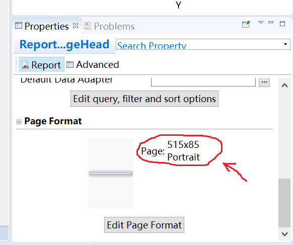

# 报表开发说明

## 开发环境
### 资源
> [报表开发说明](/developer)  http://114.115.217.120:8860/developer/

> [接口文档](/docs/)  http://114.115.217.120:8860/docs/

> [Postman文件](/developer/docs/postman_report.json)  http://114.115.217.120:8860/developer/docs/postman_report.json

> [DynamicReports DEMO]() shared(\\fileserver)\Coding\07 OSE\09 报告图表\dynamicreports-3.0.4.zip

### 主要依赖说明

目前使用`JasperReport` + `DynamicReports`，实现制作动态报表。

|Group ID|Artifact ID|版本|说明|参考|
|:---|:---|:---|:---|:---|
|net.sf.jasperreports|jasperreports|6.4.0|JasperReport|&nbsp;|
|net.sourceforge.dynamicreports|dynamicreports-core|5.1.0|DynamicReports 核心|&nbsp;|
|net.sourceforge.dynamicreports|dynamicreports-adhoc|5.1.0|DynamicReports adhoc|&nbsp;|
|org.apache.xmlgraphics|xmlgraphics-commons|2.1|图形操作|&nbsp;|
|commons-codec|commons-codec|1.11|公共的编解码实现|&nbsp;|

## 工程结构

### 工程目录结构

```tree
/ose-parent
  │
  ├─ ...                        其他基础工程
  ├─ ose-report-api           报表服务子系统的接口工程
  │  └─src/main
  │      ├─java
  │      │  └─com
  │      │      └─ose/report
  │      │         ├─api              报表服务接口定义
  │      │         ├─domain           领域
  │      │         │  ├─model        报表制作用模型
  │      │         │  └─service      报表制作服务
  │      │         ├─dto              接口数据传输对象
  │      │         │  ├─report       报表制作用数据传输对象（主报表）（检查单/周报等）
  │      │         │  └─subreport    报表制作用数据传输对象（子报表）（明细/图片等）
  │      │         ├─entity           相关数据实体
  │      │         ├─exception        报表制作例外
  │      │         ├─template         动态模板
  │      │         └─vo               类型约束
  │      └─resources                   报表制作用资源
  │          ├─fonts                   报表外挂字体
  │          ├─images                  报表静态图片
  │          └─jaspertemplate          JasperReports 静态模板
  │              └─checklist           检查单模板
  │
  ├─ ose-report                       报表服务子系统的业务实现工程
  │  └─src/main
  │      ├─java
  │      │  └─com/ose/report
  │      │      ├─config
  │      │      ├─controller
  │      │      └─domain              领域
  │      │          ├─repository      相关数据实体操作接口定义
  │      │          └─service         业务逻辑接口定义
  │      │              └─impl        业务逻辑实现
  │      ├─resources
  │           ├─ developer             开发说明
  │           ├─ templates             FreeMarker 模板
```

## 注意点

* 静态模板高度
  DynamicReports中使用静态模板构建子报表时，要设置子报表的高度。
  并且，静态模板中的设定高度要与程序中设定的子报表的高度保存一致，否则会发生溢出的异常。

  DynamicReports中设定高度的方法如下：

  ```text
  // 组装子报表
  SubreportBuilder subReportBuilder = cmp.subreport(subReport);
  subReportBuilder.setFixedHeight(template.getFixedHeight());
  ```

  1) 检查单中使用了可变的头和签字栏模板，这两个模板的高度在数据库的表
  `ose-report.report_templates`中设置。这个高度要与制作的模板高度保存一致。

  2) 模板的高度查看方式如下。再Jaspersoft Studio中点击`outline`中的顶层，
  查看模板的`properties`。如下如图
   

* 检查单图片附件
  图片附件的实现目前使用DynamicReports进行动态生成。支持资源路径及Base64两种方式进行设置。
  实现代码位于`ChecklistReportGeneratorService > assembleReportAttachment`。

<footer><center>&copy; 2018 LiveBridge</center></footer>
